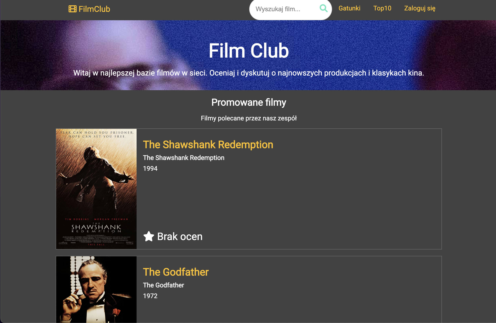
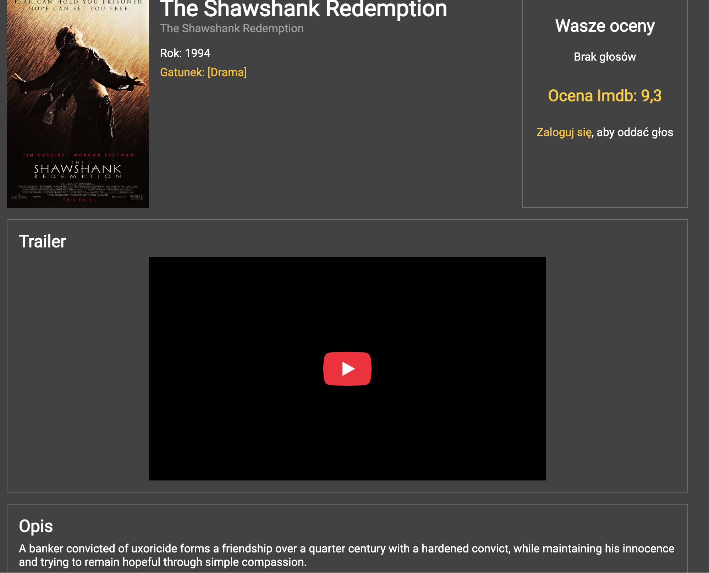

<div id="top"></div>

<div align="center">

# FILM-CLUB

<em>Discover, Rate, and Share Your Cinematic Journey</em>

<!-- BADGES -->


<em>Built with the tools and technologies:</em><br>


</div>
<br>

---

## Table of Contents

- [Overview](#overview)
- [Features](#features)
- [Architecture](#architecture)
- [Getting Started](#getting-started)
    - [Prerequisites](#prerequisites)
    - [Installation](#installation)
    - [Usage](#usage)
- [Screenshots](#screenshots)
- [Demo application](#demo-application)
- [Contributing](#contributing)

---

## Overview

Film-Club is a web application for film enthusiasts, enabling users to discover, manage, rate, and share films. The application provides a modern platform for managing film data, user profiles, and community-driven ratings.

---

## Features

- 🎉 **Docker Integration:** Simplifies deployment with a pre-configured Dockerfile.
- 🚀 **Spring Boot Framework:** Robust, scalable backend built with Java and Spring Boot.
- 🔐 **User Management:** Secure registration, login, and user role management.
- 🎬 **Film Management:** CRUD operations on films, including pagination and genre filtering.
- ⭐ **Rating System:** Users can rate and review films, fostering engagement.
- 📚 **Genre Management:** Categorize and browse films by genre.
- 📖 **RESTful API:** Well-structured endpoints for frontend and external integrations.

---

## Architecture

- **Backend:** Java, Spring Boot, Maven
- **Frontend:** HTML, CSS, Thymeleaf
- **Containerization:** Docker
- **Database:** (Specify if e.g. MySQL/H2)

The system follows a standard layered architecture:
1. **Controller** – Exposes REST API endpoints.
2. **Service** – Encapsulates business logic.
3. **Repository** – Handles database operations (Spring Data JPA).
4. **Security** – Manages authentication, authorization, and password hashing.

---

## Getting Started

### Prerequisites

- **Java 17+**
- **Maven 3.8+**
- **Docker** (optional, for containerized deployment)

### Installation

**1. Clone the repository:**
```sh
git clone https://github.com/danielStrielnikow/Film-Club
cd Film-Club
```

**2. Build the project & install dependencies:**

- Using Docker:
    ```sh
    docker build -t film-club .
    ```
- Using Maven:
    ```sh
    mvn clean install
    ```

### Usage

**Run with Docker:**
```sh
docker run -p 8080:8080 film-club
```
Your app will be available at [http://localhost:8080](http://localhost:8080)

**Run with Maven:**
```sh
mvn spring-boot:run
```
App will be available at [http://localhost:8080](http://localhost:8080)

---

## 🖼️ Screenshots

### 🏠 Home Page



### 🛒 Film List




### ⚙️ Login Panel


---

## Demo application

💻 [FilmClub – version demo](https://filmclub-z7r9.onrender.com/)

## Contributing

Contributions are welcome! Please open issues and submit pull requests for new features, bug fixes, or suggestions.

1. Fork the repository
2. Create your feature branch (`git checkout -b feature/YourFeature`)
3. Commit your changes (`git commit -am 'Add some feature'`)
4. Push to the branch (`git push origin feature/YourFeature`)
5. Open a Pull Request

---

<div align="left"><a href="#top">⬆ Return</a></div>
